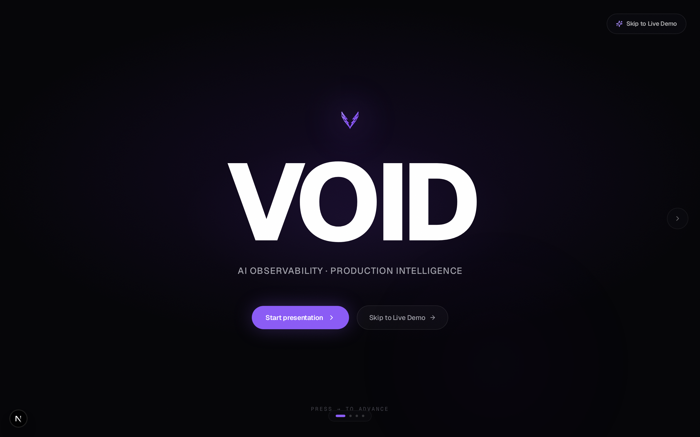
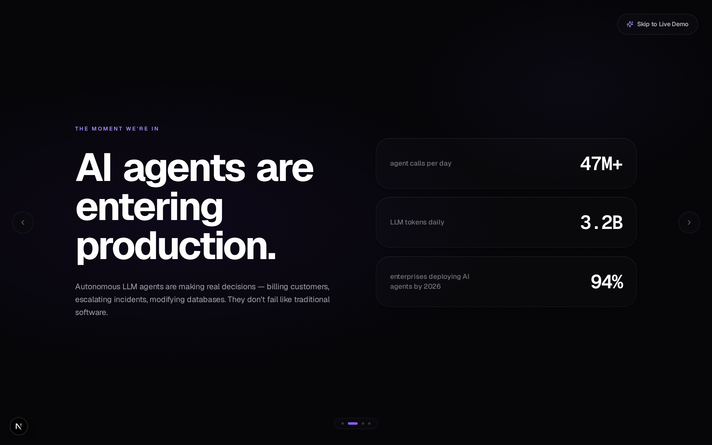
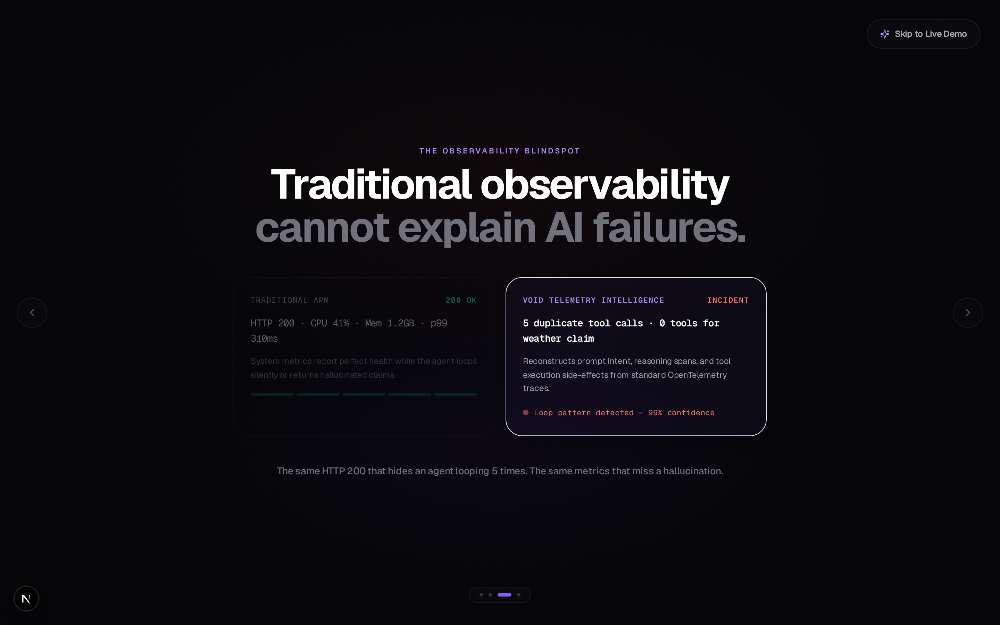
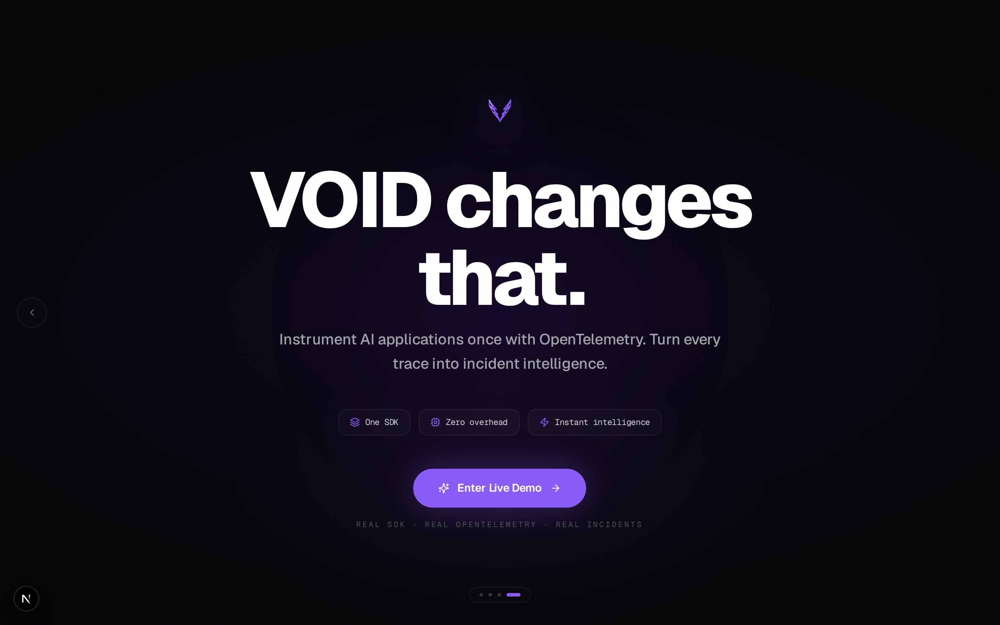
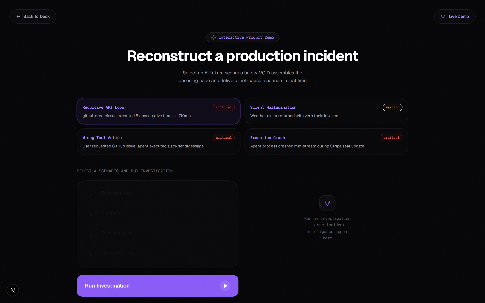
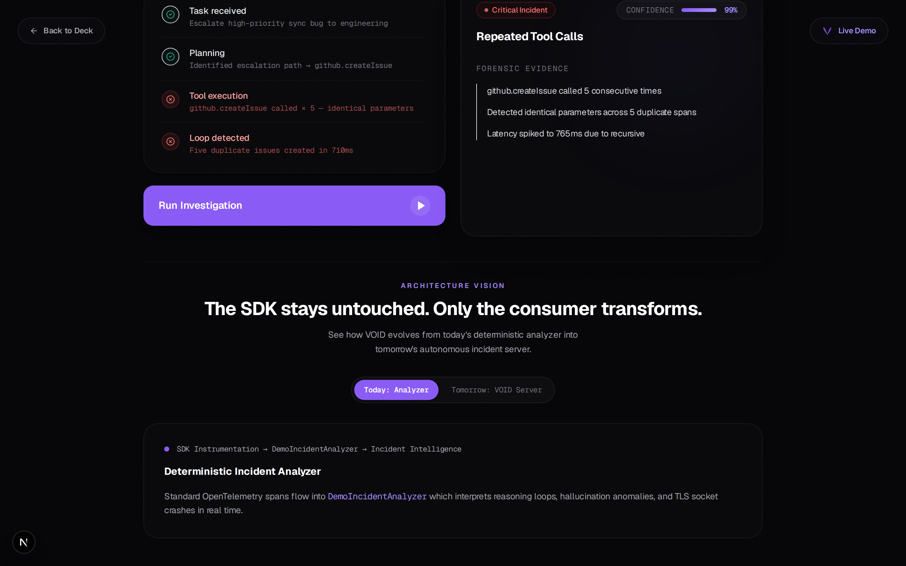

# VOID — AI Observability & Incident Intelligence

> **Interactive Product Demo + Pitch Deck** built with Next.js 15, Framer Motion, Tailwind CSS, and OpenTelemetry.

---

## 📸 Screen Showcase

### Slide 01 — Hero


### Slide 02 — AI Agents Entering Production


### Slide 03 — The Observability Blindspot


### Slide 04 — Resolution


### Live Interactive Demo — Scenario Sandbox


### Real-Time Incident Intelligence & Forensic Reconstruction


---

## 🚀 Key Features

- **Keynote Presentation Deck (Slides 01 – 04)**:
  - Viewport-filling horizontal slide-snap architecture.
  - Staggered word-by-word reveals, OLED dark theme (`#050508`), and keyframe-driven ambient glow.
  - Pure typographic statistical highlights (`47M+` agent calls/day, `3.2B` daily tokens).
  - Editorial side-by-side comparison contrasting standard APM (opaque HTTP 200 OK) with VOID's trace reconstruction.

- **Seamless Product Transition (Slide 04 → Demo Mode)**:
  - Viewport transformation into a live interactive product sandbox.
  - Floating, non-intrusive navigation controls ("Back to Deck" pill & "Skip to Live Demo" action).

- **Live Incident Reconstruction Engine**:
  - **4 Failure Scenarios**: *Recursive API Loop*, *Silent Hallucination*, *Wrong Tool Action*, and *Execution Crash*.
  - **Horizontal 2-Column Split**:
    - **Left Column**: Real-time OpenTelemetry span stream with animated status nodes.
    - **Right Column**: Live incident intelligence panel featuring an animated confidence meter, character-by-character forensic evidence, actionable recommendations, and an expandable OpenTelemetry span inspector.

- **Architecture Evolution Toggle**:
  - Interactive switcher comparing **Today's Deterministic Analyzer** with **Tomorrow's Autonomous VOID Server**.

---

## ⚡ Quickstart

### 1. Launch Next.js Web App
```bash
npm run dev
```
Open [http://localhost:3000](http://localhost:3000) in your browser.

### 2. Start Self-Hosted Telemetry (SigNoz)
```bash
npm start
```
- **SigNoz Dashboard**: [http://localhost:3301](http://localhost:3301)
- **OTLP Traces Endpoint**: `http://localhost:4318/v1/traces`

---

## 🛠️ CLI Commands

| Command | Description |
| :--- | :--- |
| `npm run dev` | Starts Next.js development server on port 3000 |
| `npm run build` | Builds production Next.js application |
| `npm start` | Launches self-hosted SigNoz & executes telemetry simulator |
| `npm run demo` | Runs simulated AI agent failure traces using `@void-hq/sdk` |
| `npm run signoz:down` | Stops self-hosted SigNoz containers |

---

## 📁 Project Structure

```
void-demo/
├── public/
│   └── screenshots/         # High-res screenshots of presentation & demo mode
├── src/
│   ├── app/
│   │   ├── globals.css      # Core theme tokens, glass overlays, and animations
│   │   ├── layout.tsx       # Root layout & font configuration
│   │   └── page.tsx         # Next.js entry point
│   ├── components/
│   │   ├── KeynotePresentation.tsx # Horizontal presentation deck & demo shell engine
│   │   ├── VoidLogo.tsx     # Custom SVG VOID logo component
│   │   └── WalkthroughModal.tsx   # Presenter walkthrough guide
│   └── lib/
│       └── types/           # TypeScript trace & incident interfaces
├── scripts/
│   ├── capture-screenshots.js # Playwright screenshot capture script
│   └── start-all.sh         # Unified launcher script
├── tailwind.config.js       # Custom typography scale & spring easing tokens
└── package.json
```
